# Agentic LLM toggle — architecture

Planning artifact for the **Agentic LLM tool routing + synthesis** feature.

This doc covers:
1. What the **legacy** flow actually does today (with the right rule-based vs LLM labels).
2. What the **agentic** flow will add.
3. How they coexist (toggle / cohort / shadow modes).
4. Data sources, request flow, and open decisions before code lands.

> **Single-agent, not multi-agent.** The agentic flow uses ONE
> decision-making LLM (the router) plus a deterministic tool registry.
> Tools are functions, not autonomous agents — they're invoked with
> specific args and return data. Some tools internally do an embedding
> call to retrieve context; none of them make routing decisions of
> their own. The synthesis step is a fixed pass over tool results, not
> a competing decision-maker. "Multi-agent" would mean multiple LLM
> personas with separate prompts handing off tasks (e.g., a researcher
> agent that hands to a writer agent) — that's a future evolution, not
> this PR.

> Review and mark up before implementation starts. Edit this file
> directly or comment on the PR — easier than chasing decisions in chat.

---

## 1. Architecture diagram

```mermaid
graph TB
    subgraph FE["Frontend · Next.js 14"]
        WIDGET["AssistantWidget<br/>chat bubble · citations · sources<br/>anon page_view + bubble_open events"]
        ADMIN["Admin dashboards<br/>/admin/leads · /admin/settings<br/>/admin/assistant-drift"]
    end

    subgraph AUTH_LAYER["Auth + identity"]
        AUTH["Google OAuth → JWT<br/>Anonymous: anon_id cookie middleware<br/>Roles: super_admin · admin · user · anon"]
    end

    subgraph API["FastAPI backend · /api/v1"]
        CHAT["/assistant/chat"]
        ANONEVT["/assistant/anon-event"]
        ADMIN_API["/admin/* (RBAC-gated)"]
    end

    subgraph GUARD["Guardrails (rule-based)"]
        GIN["check_input<br/>regex injection patterns<br/>length cap · Redis cooldown"]
        GQ["check_daily_limit<br/>Redis counter per user/anon<br/>per-user override beats global"]
        GOUT["check_output<br/>regex secret-leak<br/>length truncate"]
    end

    TOGGLE{{"settings.assistant.flow<br/>━━━━━━━━━━━━━━━<br/>legacy · agentic · percent:N · shadow<br/>admin-tunable · % cohort by hash(anon_id|user_id)"}}

    subgraph LEGACY["Legacy flow · LIVE TODAY"]
        CLF_RULE["KEYWORD classifier (RULE)<br/>substring → Intent enum<br/>fallback: admin-tunable default"]
        H_PMI_RULE["PMI handler (RULE only)<br/>keyword → URL lookup<br/>NO LLM call"]
        H_FAQ["faq_handler"]
        H_CONTENT["content_handler"]
        H_ACCOUNT["account_handler"]
        H_INSIGHTS["insights_handler"]
    end

    subgraph AGENTIC["Agentic flow · TOGGLE TARGET (single-agent tool-using)"]
        ROUTER_LLM["LangGraph router (LLM)<br/>tool-calling on gpt-4o<br/>semantic intent → tool plan"]
        T_FAQ["faq_search (LLM-embedding)<br/>embed query → pgvector<br/>returns chunks"]
        T_CONTENT["content_search (LLM-embedding)<br/>embed query → pgvector<br/>returns chunks"]
        T_PRICING["pricing_lookup (LLM-embedding)<br/>embed query → pgvector on plan<br/>OR direct DB select"]
        T_ACCOUNT["account_state (NO LLM)<br/>DB select: users · subs · payments"]
        T_INSIGHTS["user_insights (NO LLM)<br/>DB select: exam_sessions"]
        T_PMI["pmi_reference (NO LLM)<br/>settings_store URL lookup"]
        T_ESCALATE["human_escalation (NO LLM)<br/>insert into leads table"]
        SYNTH_LLM["Synthesis (LLM-generation)<br/>combine tool results<br/>cite sources · honest uncertainty"]
    end

    subgraph RAG_LAYER["RAG retrieval (BOTH flows)"]
        EMB_LLM["Embedding LLM call<br/>text-embedding-3-small<br/>1536-dim vector · ~$0.02/1M tok"]
        PGVEC[("pgvector search<br/>cosine: 1 - (emb &lt;=&gt; q)<br/>HNSW index · min_similarity filter")]
    end

    subgraph DATA["Persistence (SHARED)"]
        RAGTBL[("rag_chunks<br/>faq · question_explanation<br/>plan · upload")]
        PG[("PostgreSQL<br/>users · leads · payments · settings<br/>exam_sessions · audit_logs · rag_chunks")]
        REDIS[("Redis<br/>settings cache (30s TTL)<br/>cooldowns · daily counters")]
    end

    subgraph OBS["Observability (SHARED)"]
        DRIFT["Drift detector (HEURISTIC)<br/>refused_with_context<br/>missing_citation · invented_citation<br/>empty_response"]
        AUDITLOG["audit_logs<br/>flow=legacy · flow=agentic<br/>discriminator in schema"]
        ASSTLOG["assistant_logs<br/>redacted turn-by-turn<br/>turn_id → frontend flag link"]
    end

    WIDGET --> CHAT
    WIDGET --> ANONEVT
    ADMIN --> ADMIN_API
    CHAT --> AUTH
    ANONEVT --> AUTH
    ADMIN_API --> AUTH
    AUTH --> GIN
    GIN --> GQ
    GQ --> TOGGLE
    TOGGLE -->|"flow=legacy"| CLF_RULE
    TOGGLE -->|"flow=agentic"| ROUTER_LLM
    CLF_RULE --> H_PMI_RULE
    CLF_RULE --> H_FAQ
    CLF_RULE --> H_CONTENT
    CLF_RULE --> H_ACCOUNT
    CLF_RULE --> H_INSIGHTS
    H_FAQ --> EMB_LLM
    H_CONTENT --> EMB_LLM
    H_ACCOUNT --> EMB_LLM
    EMB_LLM --> PGVEC
    PGVEC --> RAGTBL
    H_INSIGHTS --> PG
    H_PMI_RULE --> REDIS
    ROUTER_LLM --> T_FAQ
    ROUTER_LLM --> T_CONTENT
    ROUTER_LLM --> T_PRICING
    ROUTER_LLM --> T_ACCOUNT
    ROUTER_LLM --> T_INSIGHTS
    ROUTER_LLM --> T_PMI
    ROUTER_LLM --> T_ESCALATE
    T_FAQ --> EMB_LLM
    T_CONTENT --> EMB_LLM
    T_PRICING --> EMB_LLM
    T_PRICING --> PG
    T_ACCOUNT --> PG
    T_INSIGHTS --> PG
    T_PMI --> REDIS
    T_ESCALATE --> PG
    T_FAQ --> SYNTH_LLM
    T_CONTENT --> SYNTH_LLM
    T_PRICING --> SYNTH_LLM
    T_ACCOUNT --> SYNTH_LLM
    T_INSIGHTS --> SYNTH_LLM
    T_PMI --> SYNTH_LLM
    T_ESCALATE --> SYNTH_LLM
    SYNTH_LLM --> GOUT
    H_FAQ --> GOUT
    H_CONTENT --> GOUT
    H_ACCOUNT --> GOUT
    H_INSIGHTS --> GOUT
    H_PMI_RULE --> GOUT
    GOUT --> DRIFT
    GOUT --> ASSTLOG
    DRIFT --> AUDITLOG
    ANONEVT --> AUDITLOG

    classDef fe fill:#1d4ed8,stroke:#1e40af,color:#fff
    classDef auth fill:#b91c1c,stroke:#7f1d1d,color:#fff
    classDef be fill:#475569,stroke:#334155,color:#fff
    classDef rule fill:#15803d,stroke:#14532d,color:#fff
    classDef llm fill:#db2777,stroke:#9d174d,color:#fff
    classDef agentic fill:#7c3aed,stroke:#5b21b6,color:#fff
    classDef toggle fill:#ca8a04,stroke:#713f12,color:#000
    classDef data fill:#0f766e,stroke:#134e4a,color:#fff
    classDef obs fill:#a16207,stroke:#713f12,color:#fff
    classDef guard fill:#dc2626,stroke:#7f1d1d,color:#fff

    class WIDGET,ADMIN fe
    class AUTH auth
    class CHAT,ANONEVT,ADMIN_API be
    class GIN,GQ,GOUT guard
    class TOGGLE toggle
    class CLF_RULE,H_PMI_RULE rule
    class H_FAQ,H_CONTENT,H_ACCOUNT,H_INSIGHTS llm
    class ROUTER_LLM,SYNTH_LLM llm
    class T_FAQ,T_CONTENT,T_PRICING llm
    class T_ACCOUNT,T_INSIGHTS,T_PMI,T_ESCALATE rule
    class EMB_LLM llm
    class PGVEC,RAGTBL,PG,REDIS data
    class DRIFT,AUDITLOG,ASSTLOG obs
```



### Legend

| Colour | Node type | Examples |
|---|---|---|
| **Blue** | Frontend | AssistantWidget, admin pages |
| **Red (dark)** | Auth/identity | OAuth, JWT, role check |
| **Red (bright)** | Guardrails (rule-based) | regex injection check, Redis counters |
| **Slate** | FastAPI HTTP endpoints | `/assistant/chat`, `/admin/*` |
| **Yellow** | Toggle | `settings.assistant.flow` |
| **Green** | **Rule-based logic** (no LLM call) | Keyword classifier, PMI handler |
| **Pink** | **LLM call** (generation or embedding) | gpt-4o chat completion, text-embedding-3-small |
| **Purple** | Agentic-flow tool wrappers | LangGraph router, tools registry |
| **Teal** | Storage | pgvector index, Postgres tables, Redis |
| **Amber** | Observability | Drift detector, audit_log, assistant_log |

> **Why pink for LLM**: easy to spot how many LLM calls a request makes. A
> legacy FAQ turn = 2 pink (embedding + generation). An agentic turn with
> 3 tools = 4 pink (1 router + 3 embeddings + 1 synthesis).

### Per-tool LLM footprint (agentic flow)

The agentic subgraph shows tools coloured by whether they invoke an LLM
**inside the tool itself**. None of them do generation — all generation
happens once in the synthesis node. Tools that retrieve from pgvector
do an embedding call (cheap; ~$0.00002/query); tools that hit Postgres
or Redis directly use **zero LLM**.

| Tool | LLM in tool? | Why |
|---|---|---|
| `faq_search` | embedding only | needs to vectorise the query for pgvector cosine |
| `content_search` | embedding only | same |
| `pricing_lookup` | embedding only (free-text) or 0 (plan_id) | DB lookup path skips embedding |
| `account_state` | **0** | pure DB select |
| `user_insights` | **0** | pure DB select on exam_sessions |
| `pmi_reference` | **0** | settings_store URL lookup + substring keyword match |
| `human_escalation` | **0** | leads-table insert |

### Design choice: tools return data, not pre-generated answers

Two ways to wire this:

| Option | Tools return | LLM calls per turn | Trade-off |
|---|---|---|---|
| **A** ⭐ | Raw chunks / DB rows | 1 router + N embeddings + 1 synthesis | Cheaper. Synthesis sees raw evidence, can express uncertainty honestly. Easier to debug (one prompt to inspect). |
| **B** | Pre-generated mini-answers | 1 router + N (embed + generate) + 1 synthesis | ~2× cost. Each tool's answer is self-contained, so operator can see per-tool quality. Closer to "true multi-agent" feel. |

We're going with **A**. If we later find synthesis quality suffers without
per-tool reasoning, we can promote individual tools to B without
re-architecting.

---

## 2. How RAG retrieval actually works (yes, it uses an LLM)

A legacy FAQ/Content/Account turn already invokes **two LLM calls**:
the **embedding** call inside RAG retrieval, and the **generation** call
when the handler asks gpt-4o for the answer. They're very different beasts:

| Call | Model | Cost (per 1M tokens) | Latency | Purpose |
|---|---|---|---|---|
| **Embedding** | `text-embedding-3-small` (1536 dims) | ~$0.02 | ~50–100ms | Turn the user's query into a vector so we can do similarity search. NO text generation. |
| **Generation** | `gpt-4o` | ~$2.50 in / $10 out | ~1–3s | The actual answer. Reads the retrieved chunks as context. |

**Cost intuition**: embedding is ~125,000× cheaper per token than
generation. A million query embeddings cost ~$0.02; a million
generations cost thousands of dollars. When comparing legacy vs agentic
cost, count generation calls and treat embedding as noise.

The "RAG box" in the diagram is pink because of the embedding call, but
**all the real cost lives downstream in the generation call** — that's
the one the agentic toggle adds (one extra: the router decision).

### Step-by-step (legacy FAQ/Content/Account handler)

```
1. Handler receives the user message.

2. RAG retrieval — PgVectorRetriever.retrieve()
   ├─ provider.embed_one(message)                ◄── LLM call #1 (embedding)
   │     → 1536-float vector for the query
   ├─ SQL: SELECT … 1 - (embedding <=> :q_emb) AS similarity
   │       FROM rag_chunks
   │       WHERE source_type IN (:source_types)
   │         AND provider='openai' AND model='text-embedding-3-small'
   │       ORDER BY embedding <=> :q_emb
   │       LIMIT :k                              ◄── pgvector cosine search
   └─ Filter rows where similarity < rag.min_similarity (default 0.3)
       → returns top-k RetrievedChunk objects

3. build_context_block(chunks)
   → joins chunk.content into one prompt section with [Source N] labels

4. configurable_handler_system(handler.name, DEFAULT_SYSTEM)
   → reads assistant.handler.{name}.system from settings_store (Redis-cached, 30s TTL)
   → falls back to handler's hard-coded DEFAULT_SYSTEM if setting is empty

5. with_preamble(base_system)
   → prepends assistant.system_prompt_preamble (allowed/banned topics,
     ALSO ALLOWED directive, anti-refusal scaffolding)

6. provider.complete(system, history)            ◄── LLM call #2 (generation, gpt-4o)
   → OpenAI chat completion API
   → returns the answer text

7. Return { message, citations=to_citations(chunks), suggested_actions }
```

The chunks were **pre-embedded at ingest time** (when an admin saves a FAQ, edits a question explanation, uploads a doc, or updates a plan). The chunk-side embedding is cached in `rag_chunks.embedding`. Per chat turn we only embed the **query**, not the corpus.

### Provider+model matching

Critical detail: the SQL filters on `provider='openai' AND model='text-embedding-3-small'`. Vectors from different embedding models live in **different vector spaces** and aren't comparable. If we ever swap embedding models, we have to **re-embed the whole corpus** — same operation as a Pinecone/Weaviate migration. The setting key `embeddings.active_provider_id` tracks which provider is live; the registry guards against silent mismatches.

---

## 3. Operating modes — toggle vs parallel

**One flow runs per request.** The "parallel" cases below are about which flow is live system-wide during rollout.

| Mode | Setting | Per-request | System-wide | When to use |
|---|---|---|---|---|
| **A. Flat switch** | `flow=legacy` or `flow=agentic` | one flow | one flow | Day-1 cutover or emergency rollback |
| **B. Cohort split** ⭐ | `flow=percent:N` (0–100) | one flow, deterministic by `hash(anon_id\|user_id) % 100` | both run, partitioned by user | Gradual rollout (`10` → `50` → `100`). Same user always lands on same flow within the bucket, so they don't see inconsistent answers turn-to-turn |
| **C. Shadow mode** | `flow=shadow` | **both run** for the same query | both run | Pure A/B data collection. Returns legacy to user; runs agentic in background; logs both for offline comparison. **Doubles LLM cost.** Skip unless we want hard data before flipping |

The hash for mode B uses `hash((anon_id or str(user_id)) + day_key) % 100` — re-bucketed daily so a "stuck on the bad branch" user gets a fresh shot the next day. Setting `flow=percent:10` puts buckets 0–9 on agentic; the other 90 stay on legacy. Bumping to 50 expands to 0–49. No user ever flips back to legacy mid-bump (we only add to the agentic side, never remove).

`orchestrator.py` already writes `flow="legacy"` to drift records (line 74 — discriminator built in PR #54). The agentic branch just writes `flow="agentic"` instead. Drift dashboard splits the panes on that single column.

---

## 4. Current handlers — what's rule-based vs LLM

| Handler | Type | Retrieval source | LLM calls per turn |
|---|---|---|---|
| **Keyword classifier** | **Rule** (substring match) | none | 0 |
| **PMI Reference** | **Rule only** (no LLM) | settings_store URLs | 0 |
| **FAQ** | RAG + LLM | `faq`, `upload` (shared) | 2 (embed + generate) |
| **Content** | RAG + LLM | `question_explanation`, `upload` | 2 |
| **Account** | RAG + LLM | `plan` | 2 |
| **Insights** | DB + LLM (no RAG) | `exam_sessions` table | 1 (generate only — structured context, no embedding) |

### Classifier (rule-based)

```python
# backend/app/services/assistant/intent_classifier.py
KEYWORDS = [
    (Intent.PMI_REFERENCE, ["pmi.org", "register for the exam", "eco", ...]),
    (Intent.INSIGHTS,       ["my score", "weak area", "my progress", ...]),
    (Intent.ACCOUNT,        ["subscription", "billing", "price", "refund", ...]),
    (Intent.CONTENT,        ["explain", "what is", "define", "phase", ...]),
    (Intent.FAQ,            ["exam pattern", "eligibility", "fee", ...]),
]
```

First substring match wins. Fallback when nothing matches is admin-tunable via `assistant.classifier.default_intent` (currently `content`).

**Why this motivates the upgrade**: queries like "*Should I memorise GDPR penalty amounts for the test?*" don't match any keyword → fall through to the default handler. An LLM router reads intent from semantics, not from a fixed substring list.

### PMI Reference (rule-only, no LLM)

```python
# backend/app/services/assistant/handlers/pmi_handler.py
eco_keywords    = ("eco", "exam content", "outline", "syllabus", ...)
course_keywords = ("register", "enroll", "exam fee", "course bundle", ...)

if any(k in msg_lower for k in eco_keywords) and eco_url:
    return self._link_response(eco_url, title=..., body=...)
```

Returns admin-configured URLs deterministically. Stays no-LLM even in the agentic flow — exposing it as a `pmi_reference` tool means the router can choose it without burning generation tokens.

---

## 5. Guardrails (all rule-based)

`backend/app/services/assistant/guardrails.py`:

### Input checks (pre-LLM)

- **Injection regex**: blocks `ignore (all) previous instructions`, `system prompt`, `reveal your instructions`, `<system>` tags
- **Length cap**: `chat.max_input_chars` (default 4000)
- **Per-actor cooldown**: Redis `SET NX EX` with key `chat:cooldown:{u|a}{id}`, TTL `chat.cooldown_seconds`

### Daily quota

Redis counter `chat:daily:{scope}:{ident}:{day_key}`. INCR + EXPIRE 90 000s on first hit. Per-user override (`users.daily_chat_limit_override`) beats the global setting. Fails open if Redis is down (logged, not blocked).

### Output checks (post-LLM, pre-return)

- **Secret-leak regex**: blocks `sk-…`, `rzp_(live|test)_…`, private-key blocks. Replaces the whole response with `"[Response blocked by safety filter. Please rephrase.]"` if matched.
- **Length truncate**: `chat.max_output_chars` (default 4000) with ellipsis.

These run **in both flows** — the agentic flow doesn't get to skip output filtering just because it called the LLM differently.

---

## 6. Full request flow (legacy, today)

```
1. User types in widget        ─►  POST /api/v1/assistant/chat
                                    Authorization: Bearer <JWT>  (if signed in)
                                    Cookie: cpmai_anon_id=…       (if anonymous)

2. FastAPI middleware           ─►  auth_user / get_optional_user
                                    anon_id middleware mints cookie if missing
                                    CORS, request ID

3. AssistantOrchestrator.handle()
   ├─ guardrails.check_input         REGEX: injection, length, cooldown
   ├─ guardrails.check_daily_limit   REDIS: counter incr, cap check
   ├─ IntentClassifier.classify      KEYWORDS: first substring match
   ├─ LLMRegistry.get_active         settings → OpenAI gpt-4o provider
   ├─ handler = handlers[intent](db, provider)
   ├─ handler.respond()
   │     │
   │     │ FAQ / Content / Account branch:
   │     ├─ retrieve_context()
   │     │     ├─ provider.embed_one(query)      ◄── LLM #1 (embedding)
   │     │     └─ pgvector cosine search → top-k chunks
   │     ├─ build_context_block(chunks)
   │     ├─ configurable_handler_system(...)     reads from settings_store
   │     ├─ with_preamble(...)                   prepends preamble
   │     └─ provider.complete(system, history)   ◄── LLM #2 (generation)
   │
   │ Insights branch:
   │     ├─ db.query(ExamSession).filter(...).limit(5)
   │     ├─ format structured summary
   │     └─ provider.complete(system, history)   ◄── LLM #1 (generation only)
   │
   │ PMI branch:
   │     ├─ msg_lower substring check
   │     └─ settings_store.get_str → return URL  (NO LLM)
   │
   ├─ guardrails.check_output        REGEX: secret-leak, length cap
   ├─ drift.detect_and_log           HEURISTIC: tag patterns → audit_log
   └─ AssistantLog                   redacted row → turn_id

4. AssistantResponse JSON       ◄─  { turn_id, intent, message, citations,
                                       suggested_actions, provider, model_version }

5. Widget renders               ─►  Markdown body + collapsible <details>
                                    for citations + suggested-action chips
                                    Records turn_id for "Wasn't helpful" flag
```

---

## 7. Full request flow (agentic, target)

```
1–3a. Same up through guardrails + toggle resolution.

3b. AgenticRouter.handle()  (replaces classifier + dispatch)
   ├─ tools = [faq_search, content_search, pricing_lookup, account_state,
   │           pmi_reference, user_insights, human_escalation]
   ├─ LangGraph node: router (LLM tool-calling)
   │     ├─ system: "You're a CPMAI assistant. You have these tools…"
   │     ├─ provider.complete_with_tools(system, history, tools)
   │     │                                       ◄── LLM #1 (router decision)
   │     └─ → ToolCall[] (zero or more, parallel-callable)
   ├─ For each tool call → execute the tool
   │     ├─ faq_search(query):       reuses retrieve_context([faq, upload])
   │     │                                       ◄── LLM #embedding per call
   │     ├─ content_search(query):   reuses retrieve_context([question_explanation, upload])
   │     ├─ pricing_lookup(plan):    retrieve_context([plan]) OR direct PG select
   │     ├─ account_state(user_id):  PG select on subscriptions/payments
   │     ├─ pmi_reference(intent):   settings_store URL lookup (NO LLM)
   │     ├─ user_insights(user_id):  exam_sessions query
   │     └─ human_escalation(...):   leads.submit() with source=chat_escalation
   ├─ Collect tool results → assemble ToolResult[]
   ├─ LangGraph node: synthesis (LLM)
   │     ├─ system: "Synthesise an answer from these tool outputs…"
   │     ├─ provider.complete(system, history + tool_results)
   │     │                                       ◄── LLM #N (synthesis)
   │     └─ → final text + citations (aggregated from all tool results)
   ├─ guardrails.check_output        SAME post-LLM regex + length cap
   ├─ drift.detect_and_log           SAME detector, writes flow="agentic"
   └─ AssistantLog                   SAME redacted row

4–5. Same response shape, same widget rendering. The widget doesn't
     know or care which flow ran.
```

### Why this is more useful than legacy

- **Multi-tool answers in one turn.** "What's the exam pattern and how much does it cost?" today goes to ONE handler. Agentic calls `faq_search` + `pricing_lookup` and synthesises both.
- **Semantic routing.** "Should I memorise GDPR penalty amounts for the test?" — keyword classifier sends to default; router reads it as a content+PMI question.
- **Composable escalation.** Router can call `human_escalation` when it's stuck instead of guessing.
- **No more "wrong handler" failures** when the keyword classifier mis-routes.

### Why it's (modestly) more expensive

**Key insight:** embedding calls are effectively free (~$0.00002/query at
`text-embedding-3-small`). Cost lives in **generation calls**. Apples-to-
apples on generation:

| Flow | Generation calls per turn | Embedding calls | Cost vs legacy |
|---|---|---|---|
| Legacy FAQ/Content/Account | **1** (handler's completion) | 1 (RAG retrieval) | 1.0× baseline |
| Legacy PMI | **0** | 0 | ~0 |
| Legacy Insights | **1** | 0 | ~1.0× |
| Agentic, **any** number of tools (no re-plan) | **2** (router + synthesis) | one per LLM-tool called (cheap) | **~1.5–1.7×** |
| Agentic + 1 router re-plan | **3** (router × 2 + synthesis) | 1–2 | ~2.2–2.5× |
| Shadow mode (legacy + agentic) | ~3 | 2 | ~2.5–2.7× |

The number of **tools** the router picks doesn't change the generation
count: router is one call regardless of how many tools it asks for, and
synthesis is one call regardless of how much tool output it consumes.
Tools that internally embed (faq_search, content_search, pricing_lookup)
add cents per thousand queries.

The real cost variable is **router re-plans** — bounded by
`assistant.agentic.tools_max_calls` (default 4). Set lower if cost
starts climbing in observation; set higher if router accuracy needs it.

`flow=agentic` for a typical single-topic query → ~1.5× legacy cost. A
multi-topic query that today needs the user to ask twice (legacy
classifier picks one intent, misses the other) → effectively
**cheaper** in agentic because the second turn isn't needed.

---

## 8. Data sources

### What we read

| Source | Used by | Cardinality | Refresh trigger |
|---|---|---|---|
| `rag_chunks` (pgvector) | FAQ/Content/Account handlers; agentic tools | ~1000s of rows across `faq`, `question_explanation`, `plan`, `upload` source_types | On admin save (FAQ edit, question explanation edit, plan update, upload ingest) |
| `settings` (Redis-cached 30s TTL) | Everything | ~50 admin-tunable keys | On admin Save in `/admin/settings` |
| `exam_sessions` | Insights handler / `user_insights` tool | One row per submitted attempt | On user exam submit |
| `users.daily_chat_limit_override` | Guardrails | Sparse | Admin edit in users page |
| `plans`, `offer_codes` | Account handler / `pricing_lookup` tool | ~5–10 plans, dozens of codes | Admin edit |
| `audit_logs` | Drift dashboard, anon-traffic dashboard | Append-only | Every chat turn + every anon event |

### What we write

| Destination | What | Why |
|---|---|---|
| `assistant_logs` | One row per chat turn (redacted, `turn_id`, intent, provider, model) | UX flag link ("Wasn't helpful?"), per-turn audit |
| `audit_logs` (`action LIKE 'assistant.drift.%'`) | One row per drift detection | Dashboard rollup, operator triage |
| `audit_logs` (`action LIKE 'assistant.anon.%'`) | One row per anon page_view / bubble_open | Anonymous traffic dashboard |
| Redis `chat:daily:*` | Daily-cap counter | TTL 25h, auto-rolls at UTC midnight |
| Redis `chat:cooldown:*` | Per-turn cooldown lock | TTL = `chat.cooldown_seconds` |

### New writes the agentic flow adds

| Destination | What |
|---|---|
| `audit_logs` (`action LIKE 'assistant.tool.%'`) | Per-tool-call telemetry: which tool, args, success/error, latency. Feeds a future "tool usage" panel on the drift dashboard. |
| `assistant_logs.flow` (column add) | `legacy` vs `agentic` so the per-turn log distinguishes flow without joining to drift. |
| `audit_logs` (`action='assistant.router.plan'`) | Router decision: which tools it picked + confidence. Useful for "why did it call those tools?" debugging. |

---

## 9. Settings the toggle introduces

| Key | Type | Default | Purpose |
|---|---|---|---|
| `assistant.flow` | enum | `legacy` | `legacy` / `agentic` / `percent:N` / `shadow` |
| `assistant.agentic.tools_max_calls` | int | `4` | Hard cap on tool calls per router decision (cost guard) |
| `assistant.agentic.router_system` | text | shipped default | Admin-tunable router system prompt |
| `assistant.agentic.synthesis_system` | text | shipped default | Admin-tunable synthesis system prompt |
| `assistant.agentic.shadow_sampling_rate` | float | `0.0` | Fraction of shadow-mode requests to actually run agentic side (cost control) |

Same Redis-cached settings_store pattern as the rest of the system. Operator can flip flows without a deploy.

---

## 10. Open decisions (need owner input before build starts)

### 10.1 Cost ceiling per question

Apples-to-apples on generation calls (embedding cost is noise):

| Variant | Generation calls per turn | Cost vs legacy | Strength |
|---|---|---|---|
| **Single-LLM agentic** | 1 tool-calling call that retrieves + answers | **~1.0–1.2×** | Same per-turn cost as legacy; weaker on multi-tool questions; no synthesis pass to express uncertainty |
| **Router + synthesis** ⭐ | router (1) + synthesis (1); add 1 per re-plan | **~1.5–1.7×** (typical) | Better at complex / multi-topic questions; honest about uncertainty; multi-topic queries that take 2 turns in legacy land in 1 turn here (often cheaper end-to-end) |

The number of **tools** picked doesn't change the cost — router is one
call no matter how many tools it asks for. Costs only climb if the
router needs a re-plan (which we cap with `tools_max_calls`).

### 10.2 Initial tool set

- **Full** — ship all 7 tools day 1 (faq, content, pricing, account, pmi, insights, escalation)
- **Lean** — start with 3 (faq, content, pricing); add account/pmi/insights/escalation in a follow-up once router behaviour is understood on real traffic

### 10.3 Rollout cohort

- **Flat flip** — `legacy` → `agentic` (simpler, all-or-nothing)
- **Gradual** ⭐ — `percent:10` → `percent:50` → `percent:100` (slower; gives drift-dashboard side-by-side compare data)
- **Shadow-first** — `shadow` for 1 week → use comparison data to decide → then gradual rollout

---

## 11. Carry-over items (not in this PR)

- **Anonymous-traffic headline copy bug** — widget says "total chat-bubble opens" but `events` now includes page_views too. One-line label fix when we next touch `frontend/src/app/admin/leads/page.tsx`.
- **Embedding-model migration runbook** — if we ever swap from `text-embedding-3-small`, document the re-embed steps (vectors from different models live in different spaces).
