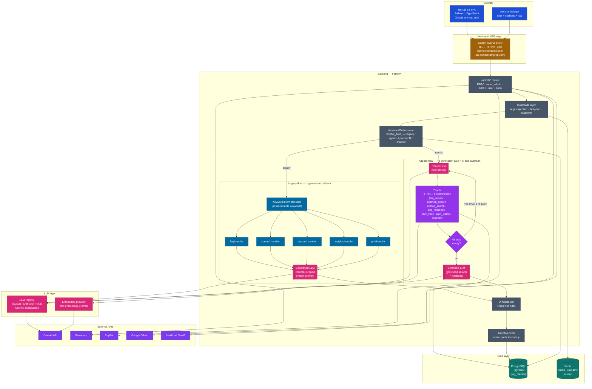

# Architecture Overview

Top-level system map for the CPMAI Prep platform. For
subsystem-specific deep-dives see:

- [agentic-toggle-architecture.md](agentic-toggle-architecture.md) — chat assistant (legacy vs agentic)
- [design-decisions.md](design-decisions.md) — why each major lever was chosen
- [known-limitations.md](known-limitations.md) — constraints + workarounds
- [deployment.md](deployment.md) — lifecycle, rollback, CI

---

## 1. High-level shape



**Reading the diagram:**

- **Pink rounded boxes** (`[[ ]]`) are LLM generation calls. Legacy uses one per turn (inside the picked handler); agentic uses two per turn (router → synthesis), plus a possible third if the re-plan loop fires.
- **Blue boxes** are legacy-flow components (keyword classifier picks one of five handlers).
- **Purple boxes** are agentic-flow components (router picks tools, tools execute, optional re-plan, then synthesis).
- All LLM calls go through the same `LLMRegistry` — the provider is runtime-configurable per environment (active OpenAI today; Anthropic / Stub registered as fallbacks for legacy).
- Both flows share the drift detector, audit log, Postgres, and embedding provider.

---

## 2. Request lifecycle (chat turn)

```
Browser           Caddy            FastAPI                Postgres / Redis    OpenAI
  │                 │                  │                          │              │
  │── POST /chat ──►│                  │                          │              │
  │                 │── proxy 8001 ───►│                          │              │
  │                 │                  │  guardrails.check_input  │              │
  │                 │                  │  (regex, length, Redis   │              │
  │                 │                  │   cooldown + daily-cap)──┼─►            │
  │                 │                  │                          │              │
  │                 │                  │  resolve_flow()          │              │
  │                 │                  │  → legacy OR agentic     │              │
  │                 │                  │                          │              │
  │                 │                  │  [agentic path]          │              │
  │                 │                  │  embed(query) ───────────┼──────────────►│
  │                 │                  │  pgvector cosine search ─┼─►            │
  │                 │                  │  router LLM call ────────┼──────────────►│
  │                 │                  │  tool exec(s) — RAG/DB   │              │
  │                 │                  │  synthesis LLM call ─────┼──────────────►│
  │                 │                  │                          │              │
  │                 │                  │  guardrails.check_output │              │
  │                 │                  │  drift detector ─────────┼─► audit_logs │
  │                 │                  │  AssistantLog row ───────┼─►            │
  │                 │                  │                          │              │
  │◄── 200 JSON ────┼──────────────────┤                          │              │
  │                 │                  │                          │              │
```

Cost: typical agentic turn ≈ 2 generation calls + 1 embedding call.
See [agentic-toggle-architecture.md §2](agentic-toggle-architecture.md#2-how-rag-retrieval-actually-works-yes-it-uses-an-llm) for the breakdown.

---

## 3. Subsystem summary

### Frontend

- **Next.js 14 App Router** (single SPA)
- Route-level auth probing via `auth.me()`; admin pages bounce non-admins
- `AssistantWidget` mounts globally (bottom-right bubble on every page)
- Typed API client (`lib/api.ts`) — full TypeScript surface
- Built once into a static + SSR bundle; served by Next's `npm run start` in
  a Docker container, fronted by Caddy

### Backend

- **FastAPI + uvicorn** (single process)
- **Routes** under `/api/v1/*` with a sub-router for `/admin/*` gated by
  `Depends(get_admin_user)`
- **Settings store** — runtime-configurable knobs (chat limits, LLM provider,
  classifier keywords, agentic toggle, etc.). Three-tier cache:
  Postgres (authoritative) → Redis (30s TTL) → in-process dict.
  Invalidation via Redis pubsub when an admin saves.
- **Audit log** — every notable event lands in `audit_logs` keyed by a
  structured action prefix (`auth.*`, `assistant.drift.*`, `assistant.anon.*`,
  `assistant.agentic.turn`, `assistant.shadow.*`). Operator dashboards
  query the same table.

### Chat assistant

Two orchestration flows, runtime-toggleable per request:

| Flow | Decision-maker | LLM calls / turn | Best for |
|---|---|---|---|
| **Legacy** | Keyword classifier (substring match) | 1 embedding + 1 generation | Single-intent questions where keyword routing works (cheap) |
| **Agentic** | LLM router with tool calling | 1 router + 1 synthesis + N embeddings | Multi-topic questions, off-keyword intent, user-state lookups, escalation |

Switch via `assistant.flow` setting:
- `legacy` / `agentic` — flat
- `percent:N` — gradual rollout (deterministic per-user cohort)
- `shadow` — both run, log agentic for offline comparison; user gets legacy

Full deep-dive: [agentic-toggle-architecture.md](agentic-toggle-architecture.md).

### RAG retrieval

- **pgvector** in Postgres — single source of truth for embedded chunks
- **Sources** indexed automatically on CRUD:
  - `faq` — admin-edited FAQ rows
  - `question_explanation` — per-question "why this is the answer" text
  - `plan` — pricing plan metadata
  - `upload` — admin-uploaded reference docs (PDF / DOCX / MD)
- **Embedding model**: OpenAI `text-embedding-3-small` (1536-dim). Swappable
  via the `EmbeddingRegistry`, though changing the model requires a full
  corpus re-embed (vectors from different models live in different spaces).
- **Similarity threshold** + top-k tunable via `rag.min_similarity` /
  `rag.top_k` settings.

### Observability

- **Structured JSONL logs** → `backend/logs/app.jsonl` (bind-mounted on host)
- **Drift detector** — runs on every chat turn (when enabled). Four rules:
  - `refused_with_context` — LLM hedged but retrieval found chunks
  - `empty_response` — LLM returned <20 chars
  - `missing_citation` — chunks retrieved but no `[Source N]` in response
  - `invented_citation` — `[Source N]` cited beyond actual chunk count
- **Per-turn audit row** for agentic turns — captures `tools_called` (with
  per-tool latency), `replans_fired`, total `elapsed_ms`
- **Dashboards** — `/admin/assistant-drift` (drift counts + tool-usage table),
  `/admin/leads` (anonymous-traffic widget + lead pipeline), `/admin/chat-history`
  (per-user transcripts + flagged-turn queue)

### Auth

- **Google Sign-In** (one-tap) — primary path
- **Password (argon2)** — fallback + bootstrap admin
- **JWT** access token (default 4h) + refresh token (default 1 day), both **admin-tunable at runtime** via `/admin/settings` (`auth.access_token_expire_minutes` 5–1440 · `auth.refresh_token_expire_days` 1–30)
- **Roles**: `super_admin`, `admin`, `user`, plus anonymous visitors tracked
  by a cookie-bound `anon_id` for funnel analytics

### Payments

- Two rails, auto-routed by currency:
  - **Razorpay** for INR (Indian residents)
  - **PayPal** for USD / EUR / others (international)
- Webhook signature verified, orders idempotent on Razorpay's `order_id`
- Currency selector + FX rates admin-editable via `/admin/pricing`

### Data

- **Postgres 16** with `pgvector` extension (rag_chunks)
- **Redis 7** — settings cache, rate-limit counters, pubsub for cache invalidation
- **No object storage** — uploaded docs are chunked, embedded, then the
  raw bytes are discarded (only `rag_chunks` rows persist)

### Hosting

- **Hostinger VPS** — single Linux box, Docker Compose orchestration
- **Caddy** — reverse proxy with automatic LetsEncrypt TLS
- **GitHub Actions** deploys on push to `main`:
  1. CI tests (backend pytest + frontend vitest)
  2. SSH to VPS → `scripts/vps/deploy.sh`
  3. Smoke test against `https://api.cpmaiexamprep.com/health`

---

## 4. Data model cheat sheet

Key tables (every table is listed in `backend/app/models/`):

| Table | Purpose |
|---|---|
| `users` | Auth identity, roles, GDPR-soft-delete tracking |
| `subscriptions` | Plan + period + expiry; paywall reads `status='active' AND expires_at > now()` |
| `plans`, `offer_codes` | Pricing catalogue + promotions |
| `payments` | Razorpay / PayPal transaction records |
| `leads` | Marketing-form submissions + chat callbacks + agentic escalations |
| `questions`, `exam_sets`, `exam_set_questions` | Mock-exam content |
| `exam_sessions`, `exam_attempt_answers` | Per-user attempt records |
| `faq_items` | FAQ CRUD source |
| `rag_chunks` | Embedded chunks for retrieval (pgvector column) |
| `assistant_logs` | One row per chat turn (redacted, with intent/provider/model) |
| `assistant_flagged_turns` | HITL queue: flag → admin reply → user sees → resolve |
| `audit_logs` | Catch-all event log keyed by structured action prefix |
| `system_settings` | Runtime-configurable knobs (settings_store source of truth) |
| `llm_providers`, `payment_providers` | Pluggable provider configs with encrypted API keys |
| `journey_events` | Funnel telemetry (signup → first attempt → first payment) |

---

## 5. Where to start in the code

| Goal | Start here |
|---|---|
| Understand chat flow | `backend/app/services/assistant/orchestrator.py` |
| Add a new tool to agentic | `backend/app/services/assistant/agentic/tools/` (one file per tool) |
| Add a new chat handler (legacy) | `backend/app/services/assistant/handlers/` |
| Add a new admin endpoint | `backend/app/api/v1/endpoints/admin/` |
| Change a runtime setting | `/admin/settings` UI; validators in `backend/app/api/v1/endpoints/admin/settings.py` |
| Add a database column | `backend/app/models/<name>.py` + new Alembic migration |
| Tweak the UI | `frontend/src/app/<route>/page.tsx` or `frontend/src/components/` |
| Add a smoke check | `scripts/smoke_admin_crud.py` |
| Wire a new external API | `backend/app/services/` (one service per integration) |
