# CPMAI Prep — End-to-End Architecture Walkthrough

**Audience:** Head of Engineering review.
**Purpose:** Single document that walks the whole system from request to disk, calls out every conscious engineering decision, and shows where the iterative-but-scalable path lives.

Reading order: §1–§3 give the shape. §4–§13 are the subsystems. §14–§19 cover the engineering standards (CI/CD, observability, quality gates, rollback). §20–§21 are scalability and discipline.

Last updated: 2026-05-25.

---

## 1. Product context in one paragraph

CPMAI Prep is a multi-tenant SaaS for exam preparation: paid courses (LMS), live cohorts (Zoom), a Retrieval-Augmented chat assistant (the original product), payments in INR + USD, and an admin CMS that lets ops change copy, prices, classifier keywords, LLM providers, social-automation cadences, and Zoom credentials **without a redeploy.** The platform runs on a single Hostinger VPS today and is intentionally architected so the path to multi-node / R2 / multi-region is a swap-not-a-rewrite.

---

## 2. System topology (one picture)

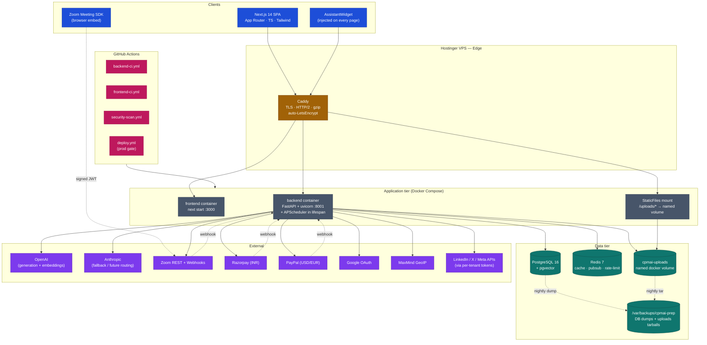

**The shape, decoded:**

- **One process per concern, not microservices.** Single FastAPI container hosts the API, the scheduler, and the static-file mount. Microservices were rejected at this stage — the team is one + AI; the operational tax of multi-service ops outweighs the (currently nonexistent) scaling benefit. We chose modular monolith with strong layer boundaries (`api/` → `services/` → `repositories/` → `models/`) so that *extracting* a service later is a refactor, not a rewrite.
- **Caddy in front of everything.** Auto-TLS + HTTP/2 + gzip with zero ops. Nginx was the obvious alternative but Caddy's `Caddyfile` is a fifth the size and LetsEncrypt is built-in.
- **State lives in three places, on purpose.** Postgres (authoritative), Redis (volatile cache + rate-limit + pubsub), and a docker named volume (`cpmai-uploads`) for blobs. Backups capture all three.

---

## 3. Request lifecycle (a public read)

```
Browser            Caddy          FastAPI                Redis            Postgres
   │                 │                │                     │                 │
   │── GET /api ────►│                │                     │                 │
   │                 │── proxy ──────►│                     │                 │
   │                 │                │  tenant_id resolve  │                 │
   │                 │                │  (host or JWT) ─────┼────────────────►│
   │                 │                │                     │                 │
   │                 │                │  settings_store ────┤  miss → DB read │
   │                 │                │  (30s TTL cache)    │                 │
   │                 │                │                     │                 │
   │                 │                │  RBAC dep ──────────┼────────────────►│
   │                 │                │  (Depends(get_user))│                 │
   │                 │                │                     │                 │
   │                 │                │  endpoint logic ────┼────────────────►│
   │                 │                │                     │                 │
   │                 │                │  audit_log() write  │                 │
   │                 │                │  (if mutating) ─────┼────────────────►│
   │                 │                │                     │                 │
   │◄── 200 JSON ────┼────────────────┤                     │                 │
```

Three things that are non-obvious:

1. **Tenant is resolved before anything else.** Either from the request host (subdomain → `tenants.host_pattern`) or from the JWT claim. Every query downstream reads `get_current_tenant_id()` — there is no global "current user can see everything" path.
2. **Settings are cached at three levels.** Postgres (authoritative) → Redis (30s TTL, pubsub-invalidated) → per-request memoization. Saves an ORM round-trip per request and lets ops `PATCH /admin/settings` and see the change in <1s across all pods (when we go multi-node).
3. **Audit log is structured prefix.** `auth.login`, `assistant.drift.*`, `zoom.session.created`, `social.run.posted`. The same table backs every operator dashboard, so adding a new dashboard = `SELECT … WHERE action LIKE 'prefix.%'`.

---

## 4. Multi-tenancy as foundation — contract I-1

This was a Day-1 decision and it shapes everything else. Migration `0023_tenants_foundation.py` introduced `tenants` + a `tenant_id` column on every owned table. The contract (`docs/contracts/I-1.md`):

| Rule | Enforcement |
|---|---|
| Every owned row has `tenant_id NOT NULL` | Alembic check in `scripts/preflight.sh` |
| Every query filters by `tenant_id` | Reviewer convention + `get_current_tenant_id()` dep |
| Cross-tenant access requires explicit super-admin role | `get_super_admin_user` dep + audit log |
| Tenant resolution before request handlers | `app/core/tenant.py` ContextVar set in middleware |

**Why this matters for the HoE conversation:** the platform is single-tenant today (one tenant row) but every read/write path is already isolated. Onboarding a second tenant is a config exercise, not a re-architecture. The cost was modest: `tenant_id` on ~25 tables and a small set of helpers.

---

## 5. Data architecture

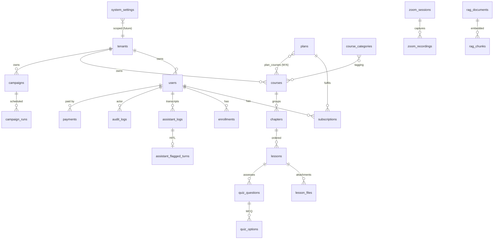

**Decisions worth flagging:**

- **Postgres + pgvector, not a separate vector DB.** Same connection pool, same backup, same migration tool. Latency at our scale is <50ms cosine over ~50k chunks — no Pinecone tax.
- **`JSONB` for evolving shapes** (campaign config, lesson content, settings values). Strict tables for everything queried by predicate. Hybrid keeps Alembic migrations rare for product iteration.
- **No ORM lazy-loading across requests.** Repository layer always returns plain dicts or detached entities. Prevents N+1 surprise and makes the eventual GraphQL/service-extraction step cheap.
- **Soft-delete via `is_deleted`/`deleted_at`** on user-visible content (courses, lessons, users). Hard-delete reserved for explicit GDPR-erasure path (`/api/v1/users/me/data-deletion`).

---

## 6. Runtime configuration — the `settings_store` pattern

This is one of the platform's load-bearing decisions. The single principle: **anything ops should be able to change without a redeploy lives in `system_settings`.**

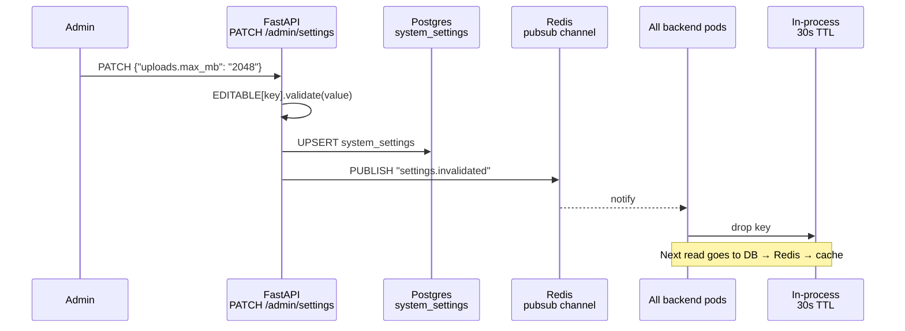

Three things keep this safe:

| Concern | Mechanism |
|---|---|
| Arbitrary key writes | `EDITABLE: dict[str, Validator]` whitelist — unknown keys → 422 |
| Type errors at runtime | Each validator returns `(ok, normalized)`; coerces strings before write |
| Secret leakage in GET | `SECRET_KEYS: frozenset` — values masked to last-4 chars in API responses |

There are three sources of truth in priority order: `settings_store.get(...)` > env var > hardcoded default. Code reads through a helper (`_max_upload_bytes()` is a typical example) so adding a key is mechanical:

```python
# uploads.py — read pattern
def _max_upload_bytes() -> int:
    mb = settings_store.get_int("uploads.max_mb", 0)   # 1. runtime override
    if mb <= 0:
        mb = int(os.environ.get("MAX_UPLOAD_MB", "1024"))  # 2. deploy override
    return mb * 1024 * 1024                              # 3. hardcoded floor
```

PR #79 (just deployed) made Zoom credentials + new social handles + the upload cap all hot-editable. Operators rotate Zoom OAuth secrets at 09:00 and the next request picks them up.

---

## 7. Authentication & authorization

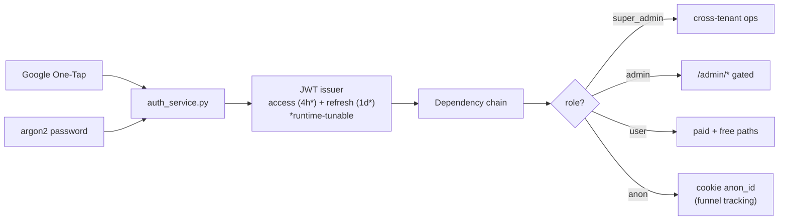

Decisions:
- **No password reset email loop yet** — Google is the primary path; the password fallback is for the bootstrap admin and recovery cases. This is a documented `known-limitations.md` item, scheduled for the auth-hardening PR.
- **Access/refresh TTLs are admin-tunable** (`auth.access_token_expire_minutes` 5–1440, `auth.refresh_token_expire_days` 1–30). This let us tighten the rotation window during a security review without a redeploy.
- **Anonymous tracking is intentional.** A cookie-bound `anon_id` lets us measure funnel drop-off without a login. Cleared on logout to comply with GDPR.

---

## 8. The chat assistant — two flows, one switch

The assistant was the product's origin. It runs two orchestration flows in the same codebase and can switch between them at runtime per request, including a shadow mode for offline comparison. Full deep-dive in `docs/agentic-toggle-architecture.md`; the summary:

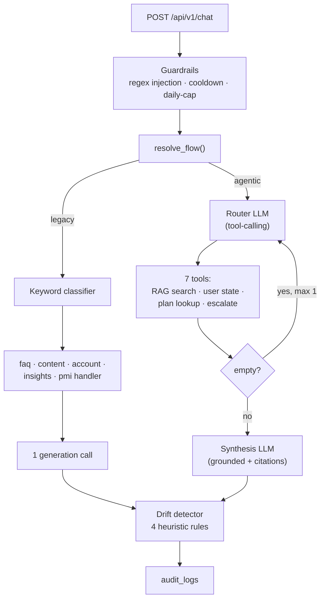

Switch values for `assistant.flow`: `legacy`, `agentic`, `percent:N` (deterministic per-user cohort), `shadow` (both run, user sees legacy, agentic logged for offline diff). This let us roll out the agentic flow at 10% → 50% → 100% with one PATCH per step and a rollback at the same speed.

---

## 9. LMS subsystem

Courses → chapters → lessons → (files + quiz_questions → quiz_options). Built in PR #6/#7. Notable choices:

- **Plan ↔ Course is M:N** (`plan_courses`). One plan can include multiple courses; one course can ship in multiple plans (e.g. "intro" appears in both Free and Pro).
- **Enrollment is computed, not stored as duplicate state.** A user has access to a course if `(subscription is active AND course ∈ plan_courses[subscription.plan])` OR `(explicit enrollment row exists)`. No drift between "I paid" and "I can see it."
- **File uploads are admin-gated and stream-capped.** Per-request cap evaluated through `_max_upload_bytes()` so the operator can change the limit live. Path is `/{tenant_id}/{YYYY}/{MM}/{uuid}-{safe_name}` — tenant-isolated and date-partitioned for `find` reclaim.
- **`file_object_key` column is already in the schema** — when we swap to R2 in PR #9, the renderer prefers `file_object_key` over the local URL. The migration is data-fill, not schema-change.

---

## 10. Zoom integration

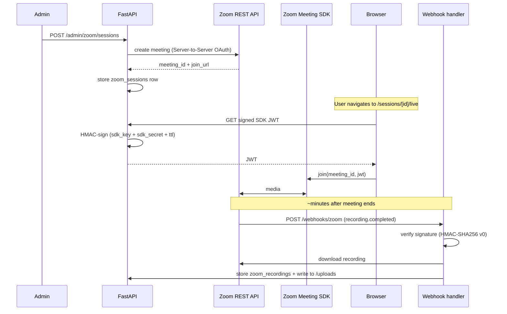

Decisions:
- **OAuth Server-to-Server** (not user OAuth) — single host account, admin-issued, lives in `system_settings` as `zoom.oauth_client_id` / `zoom.oauth_client_secret`. Rotatable live (PR #79).
- **Webhook signature is verified before deserialization.** Zoom's `v0` scheme: `HMAC-SHA256(secret, "v0:{ts}:{body}")`. Replay window 5 min.
- **Recordings land in the same `cpmai-uploads` volume** as lesson files. One backup path, one access-control path. They become `LessonFile` rows so the existing player just works.

---

## 11. Social media automation

Built in PR #77. Architecture is intentionally boring:

```mermaid
graph TB
    SCHED["APScheduler<br/>AsyncIOScheduler<br/>(in FastAPI lifespan)"]
    CAMP[("campaigns table<br/>cron + workflow + config_json")]
    RUN[("campaign_runs table<br/>idempotent execution log")]
    RUNNER["WorkflowRunner base<br/>weekly_content · auto_clip ·<br/>repurpose · respond")"]
    LLM["LLMRegistry<br/>(reuses assistant infra)"]
    SOCIAL["LinkedIn · X · Meta APIs"]
    QUEUE["/admin/social-queue<br/>(operator review before post)"]

    SCHED --> CAMP
    CAMP --> RUNNER
    RUNNER --> LLM
    RUNNER --> RUN
    RUN --> QUEUE
    QUEUE -->|"approve"| SOCIAL
```

- **Scheduler runs in-process**, not a separate worker. APScheduler's `AsyncIOScheduler` registers jobs on app startup, persists state in the `campaigns` table. This works to one node; the next step (multi-node) swaps for `APScheduler[Redis]` job store — one-line change.
- **Workflow runners are a base-class hierarchy.** Adding a new workflow = subclass + register. No code change to the scheduler or the admin UI.
- **No auto-post by default.** Generated posts land in `social_queue` for operator review. The `auto_post: true` config flag exists but ships off — a deliberate "humans in the loop" stance for v1.

PR #8 follow-ups (idea library, hashtag library, per-workflow LLM picker, real video gen) are scoped in `pr7-followups.md` §"PR #8 follow-ups".

---

## 12. Payments — dual-rail by currency

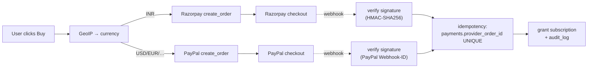

- **Currency selection driven by MaxMind GeoIP** (`mmdb` file bind-mounted; refreshed by a cron). Override allowed in the UI.
- **`provider_order_id` is a UNIQUE constraint.** Webhook double-delivery is a known pattern — DB enforces idempotency, code doesn't.
- **Auto-enrollment is a TODO** (PR scoped in `pr7-followups.md` Bucket D). Right now the payment grants a subscription; the LMS side reads subscription → plan → courses, so the user sees the course. The TODO is to also write an explicit `enrollments` row for analytics.

---

## 13. File storage — local today, R2 tomorrow

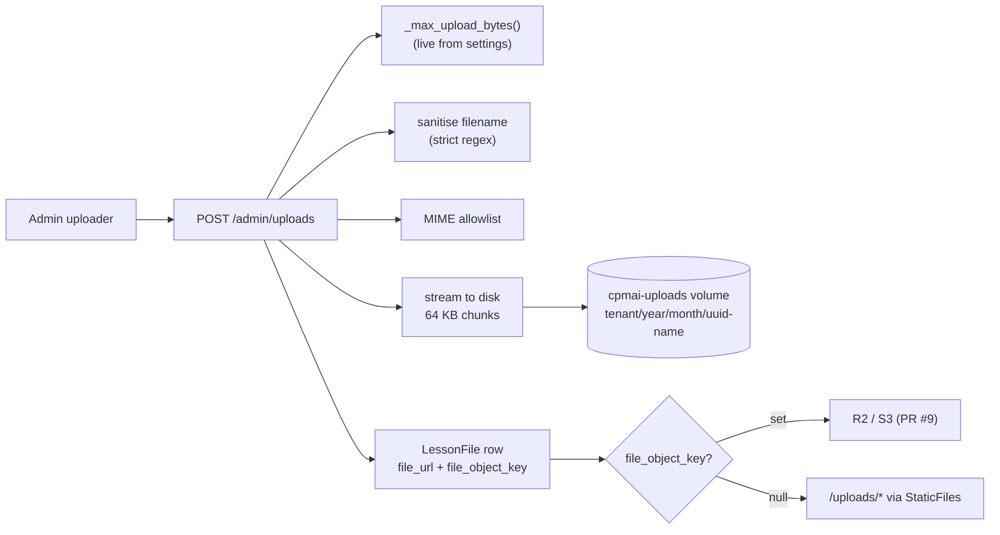

Why this stays correct under load:
- **Stream, don't slurp.** UploadFile is async; the per-chunk size check aborts before we fill disk.
- **Named volume survives deploys.** `cpmai-uploads` is referenced by both compose files. Pre-deploy hook tars it to `/var/backups`.
- **Path traversal is impossible.** Filename regex strips `..` and slashes; `relative_to(UPLOAD_ROOT)` enforced on delete.
- **R2 swap is a flag, not a fork.** `file_object_key` column already exists.

---

## 13b. Visitor Insights v2 — funnel + page-level analytics

Built on the same `journey_events` table the funnel events already used; the SPA now also writes `page.view`, `page.heartbeat`, `page.exit`, `scroll.depth`, `cta.click`, `session.start`, `session.end` via a batched `POST /api/v1/track` endpoint.

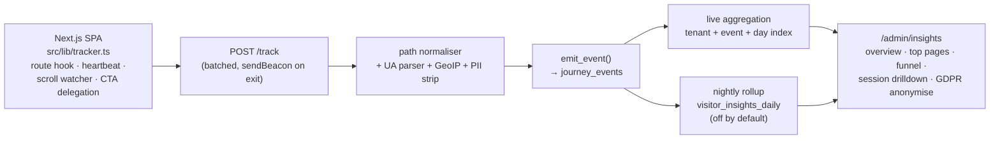

**Auto-scale property (zero-maintenance for new routes):**
The dashboard groups by route TEMPLATE (`/courses/[slug]`) not raw URL. We derive the template client-side using Next.js's `useParams()` — for any route the App Router knows how to match, the tracker replaces dynamic segment values with `[paramName]` automatically. Adding a new `app/instructors/[name]/page.tsx` page rolls up to `/instructors/[name]` from the day it deploys, with zero server change. A drift-protection vitest walks every `app/**/[*]` directory and asserts derivation works for each, so a future PR can't silently regress this.

The server keeps a generic fallback normaliser (collapses numeric ids, UUIDs, and 12+-char slugs with digits to `[*]`) for the rare events the backend emits with a raw path (referrer fields, lifecycle events).

**Levers exposed to ops (live-editable via `/admin/settings`):**
- `tracking.enabled` — master kill switch
- `tracking.sample_rate` — 0.0–1.0 per-batch sampling
- `tracking.rollup_enabled` — flip dashboard to pre-aggregated reads when journey_events growth threatens index health

**Scalability path:**
- Today: dashboards read live, ~230k rows/7d on a single index scan
- Day-1 future-proofing: `visitor_insights_daily` table created in migration 0032, populated by nightly APScheduler job (idle until `tracking.rollup_enabled=true`)
- Beyond: sampling + rollup means we don't need ClickHouse / column store at 1–10M events/day

**GDPR:** `POST /admin/insights/anonymize/{anon_id}` nulls anon_id/session_id/ua/city on every matching row but keeps the events — aggregate counts don't shift.

---

## 14. Observability

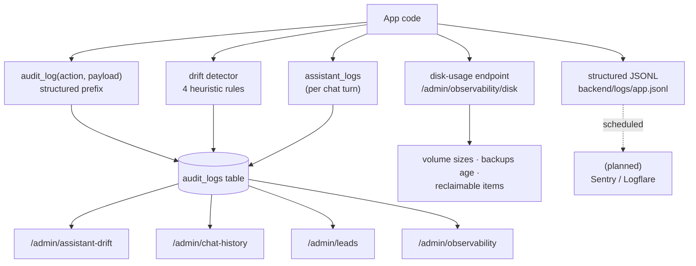

**Centralised logging plan (next infra PR):**
1. JSONL → Vector → Loki (or Sentry for errors).
2. `console.error` calls in the SPA wired to the same pipeline.
3. Disk-usage webhook fires at 80% of `cpmai-uploads`, 50 GB of backups.

What we have *today* is the audit log + per-turn assistant log + drift detector + disk metrics. The operator can see what happened; the next step is alerts and external aggregation.

---

## 15. CI/CD pipeline

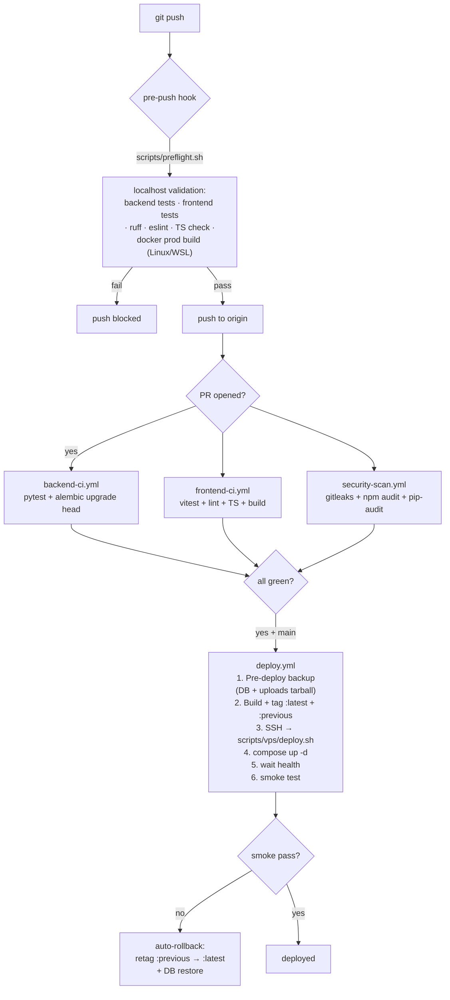

Quality gates in order of execution:

| Stage | Tooling | What it catches |
|---|---|---|
| Pre-push (local) | `scripts/preflight.sh` | Fast feedback before CI burn — runs backend pytest, frontend vitest, ruff, eslint, TypeScript check, and (Windows-WSL aware) a real `docker build -f Dockerfile.prod` so the deploy-context bugs surface locally |
| Backend CI | pytest + `alembic upgrade head` from empty DB | Migration drift, test regressions |
| Frontend CI | vitest + lint + TypeScript + `next build` | Build-time errors, peer-dep issues, env-var traps |
| Security scan | gitleaks (secrets), npm audit, pip-audit | Committed credentials, known CVEs |
| Deploy gate | All of the above must pass on `main` | One broken gate blocks every deploy — see `docs/feedback_ci_discipline.md` |

The deploy gate is sacred and is documented in `MEMORY.md` precisely because breaking it has burned us. Touching `deploy.yml`, migrations, or `alembic env.py` requires grep'ing the lessons doc first.

---

## 16. Deployment & rollback

`scripts/vps/deploy.sh` does this every time:

1. **Pre-deploy backup**: `pg_dump` + `tar cf uploads.tar /var/lib/docker/volumes/cpmai-uploads/_data`. Both `chmod 0600`, kept for 14 days.
2. **Re-tag current `:latest` → `:previous`** for both images.
3. **Build new images** (multi-stage `Dockerfile.prod`): deps → builder → runner. `--target runner` keeps the final image tiny (~250 MB frontend, ~400 MB backend).
4. **`docker compose -f docker-compose.prod.yml up -d`** with health-check gating.
5. **Smoke test** against `https://api.cpmaiexamprep.com/health`.
6. **On any failure**: auto-rollback. Retag `:previous` → `:latest`, `compose up -d`, restore DB from the pre-deploy dump if migrations ran.

Asymmetric image retention: 72h for tagged images, 24h for builder cache (`docker buildx prune`). Logs the size delta after each build so the operator can spot a runaway dependency.

**Drift discipline** (also in `MEMORY.md`): compose files, image tags, and migrations must converge on prod. Past failures came from "I changed compose locally but the VPS never re-pulled." The deploy script now always rebuilds — no `if newer` shortcut.

---

## 17. Migration discipline — contracts M-1/M-2/M-3

| Contract | Rule | Why |
|---|---|---|
| M-1 | Additive only (no `DROP`, no `ALTER … NOT NULL` on existing data) | A failed deploy leaves the old container running against the new schema — additive changes are forward-compat |
| M-2 | One migration per logical change | Bisect across migrations works, revert is surgical |
| M-3 | Always tested with `alembic upgrade head` from empty DB in CI | Catches the missing-revision-id and out-of-order branches |

Backfills go in a separate migration that runs *after* the schema migration so the new code can deploy first, then the data catches up.

---

## 18. Security posture

| Surface | Control |
|---|---|
| Secrets in DB | `SECRET_KEYS` frozenset → masked to last-4 in `GET /admin/settings` |
| Secrets in repo | gitleaks in CI; `.gitleaksignore` for legitimate fixtures |
| RBAC | `Depends(get_admin_user)` / `get_super_admin_user`; tested negatively (the test suite asserts non-admin → 403) |
| Webhook auth | HMAC verification before deserialization (Zoom v0, Razorpay X-Razorpay-Signature, PayPal Webhook-ID) |
| Path traversal | Filename regex + `relative_to(UPLOAD_ROOT)` on every read/write |
| MIME spoofing | Server-side allowlist; size cap evaluated mid-stream |
| Injection (chat) | Guardrails layer — regex + length + Redis-backed cooldown + daily cap |
| GDPR | `/api/v1/users/me/data-export` + soft-delete with PII redaction; hard-delete reserved |
| TLS | Caddy auto-LetsEncrypt; HTTP→HTTPS redirect; HSTS |
| Backups | `chmod 0600` on env tar + uploads tar (PII inside) |

The Privacy/Terms pages were a documented gap (footer 404'd) and were fixed in PR #2 of the operator-readiness work.

---

## 19. Engineering standards — the discipline layer

These are the rituals that turn "code works on my machine" into "deploy at 5pm Friday without a Slack channel of fear."

1. **Localhost-first validation.** Preflight runs the Docker prod build on Windows-WSL. Caught the `.npmrc` dotfile bug (Dockerfile `COPY package*.json ./` missed it) before the deploy ever ran.
2. **Three-step ritual for any new editable setting.** Update `EDITABLE` validator → add row to `default_settings.json` seed → extend the drift integration test. Catches the "I added a setting but it's invisible in the admin UI" class of bug (which was the PR #79 hotfix).
3. **Cherry-pick from main, never push to a merged branch.** When a follow-up fix is needed after merge, branch from `origin/main`, cherry-pick, push.
4. **CLAUDE.md / MEMORY.md as living docs.** Recurring failure modes (deploy drift, CI discipline, prod deploy mechanics) are documented inline so the next change touches them with eyes open.
5. **Audit log first, dashboard later.** Every notable action writes `audit_log(...)` before any UI exists. When the operator asks "did the webhook actually fire at 09:14?", the answer is a SQL query.
6. **Tests pin the behaviour, not the implementation.** Round-trip tests on `/admin/settings`, MIME-allowlist tests on `/admin/uploads`, RBAC negative tests on every admin endpoint.

---

## 20. Scalability roadmap — swap-not-rewrite

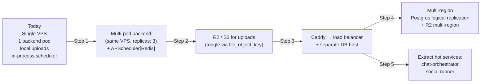

Each step is unblocked by a Day-1 decision:

| Step | Unlocked by |
|---|---|
| Multi-pod backend | Settings cache invalidation already goes through Redis pubsub |
| R2/S3 uploads | `file_object_key` column shipped in PR #6 |
| LB + DB split | No filesystem-coupled state in the API tier (uploads are the only one, and they're behind a flag) |
| Multi-region | Multi-tenancy contract I-1 means tenants are already pinned to a region-able key |
| Service extraction | `api/` → `services/` → `repositories/` layering; orchestrator doesn't reach into models |

---

## 21. What we say "no" to (and why)

| Tempting | Why we declined |
|---|---|
| Microservices on Day 1 | Operational tax > scaling benefit at 1 team / 1 VPS |
| Kubernetes | Docker Compose covers the current node count; K8s when we cross 3 nodes |
| Pinecone / Weaviate | pgvector is fast enough, one backup, one connection pool |
| Separate worker for the scheduler | APScheduler in-process is fine to one node; Redis job store is the swap |
| Auto-post social content | Operator-in-the-loop reviewed every post; trust before automation |
| Bespoke admin UI framework | Plain Next.js + Tailwind; consistent with the public site |
| Custom auth | Google one-tap + JWT + argon2; no rolled crypto |
| Premature R2 swap | Local disk on the VPS is correct until the second node arrives |

---

## Appendix A — directory map

```
backend/app/
  api/v1/endpoints/      ← routes; admin/* gated by Depends(get_admin_user)
  core/                  ← deps, exceptions, tenant resolver, settings_store, audit
  models/                ← SQLAlchemy models (one file per aggregate)
  schemas/               ← Pydantic request/response shapes
  services/              ← business logic; called by endpoints, calls repositories
  repositories/          ← data access; one per aggregate
  utils/                 ← shared helpers (LLM registry, embeddings, FX)

backend/migrations/      ← alembic; additive-only per M-1
backend/seeds/           ← default_settings.json + bootstrap data
backend/tests/           ← unit + integration; one file per aggregate

frontend/src/app/        ← Next.js App Router
  admin/*                ← admin pages; bounce non-admins client-side + server-side
  (public)               ← marketing + LMS public
  sessions/[id]/live     ← Zoom SDK embed

scripts/                 ← bootstrap.sh, preflight.sh, upgrade.sh
scripts/vps/             ← deploy.sh, backup.sh, restore.sh, install_*.sh, provision.sh

.github/workflows/       ← backend-ci, frontend-ci, security-scan, deploy

docs/                    ← architecture, contracts, lessons, backlog
docs/contracts/          ← I-1 multi-tenancy, M-1/2/3 migrations, others
```

## Appendix B — links to the deeper docs

- `docs/agentic-toggle-architecture.md` — chat assistant flows
- `docs/design-decisions.md` — major levers + why each was chosen
- `docs/known-limitations.md` — gaps + workarounds
- `docs/deployment.md` — lifecycle + rollback narrative
- `docs/vps-deployment-lessons.md` — every prod failure mode + fix
- `docs/feedback_ci_discipline.md` — what NOT to do to the deploy gate
- `docs/feedback_infra_drift.md` — compose/image/migration convergence
- `docs/contracts/I-1.md` — multi-tenancy contract
- `docs/backlog.md` — current + future work
- `docs/pr7-followups.md` — operator-surfaced gaps, prioritised
